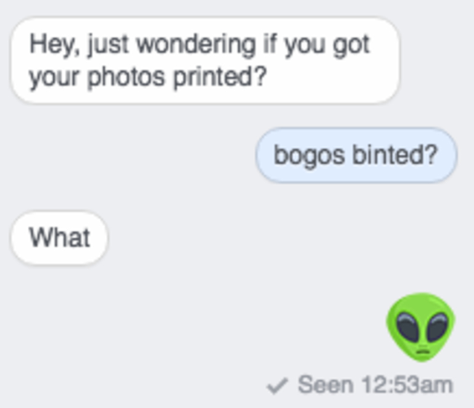

# json-image

## help

json-image is a terrible and highly impractical way to store PNG images in JSON format.

**Disclaimer:** Do not use this. Please for the love of all that is good do not use this ever. You are legally allowed to, but why?

| Original | JSON |
|---|---|
|  | [Cat JSON](images/jimg/cat.json) |
|  | [Bogos JSON](images/jimg/bogos.json) |
